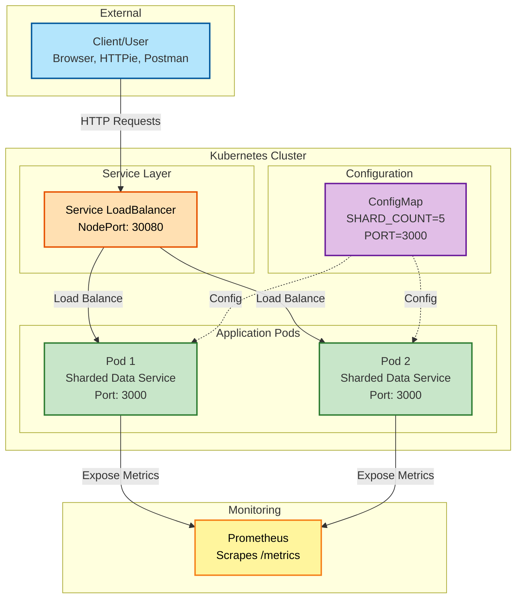
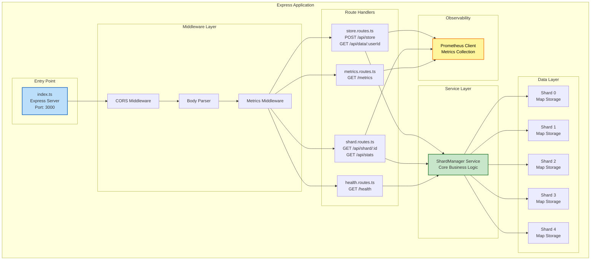
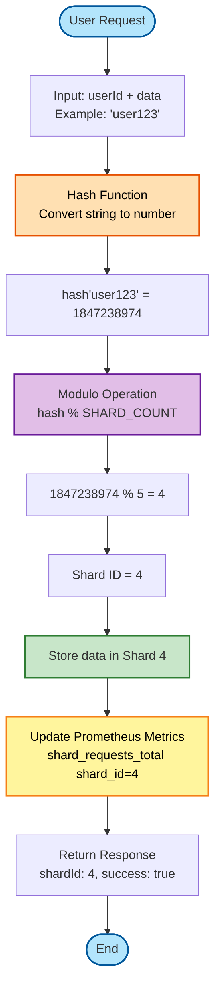
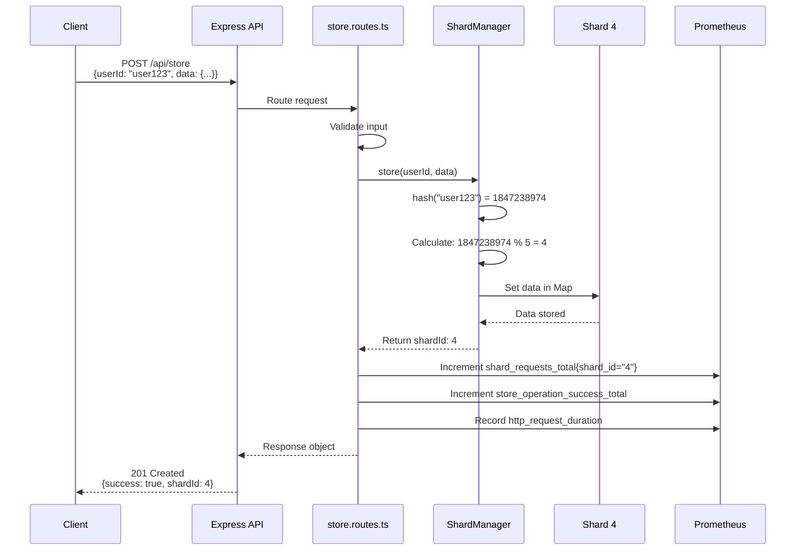
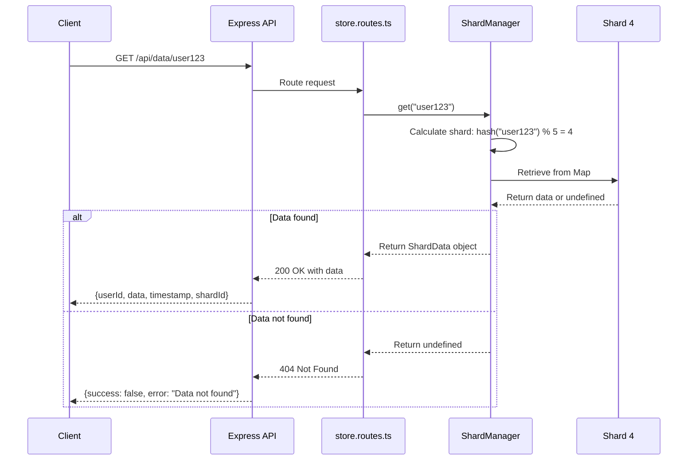
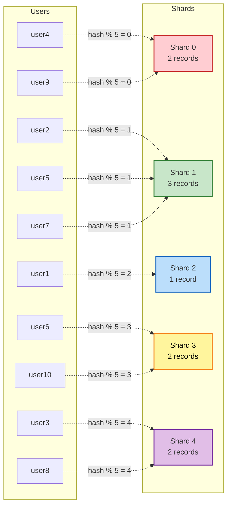
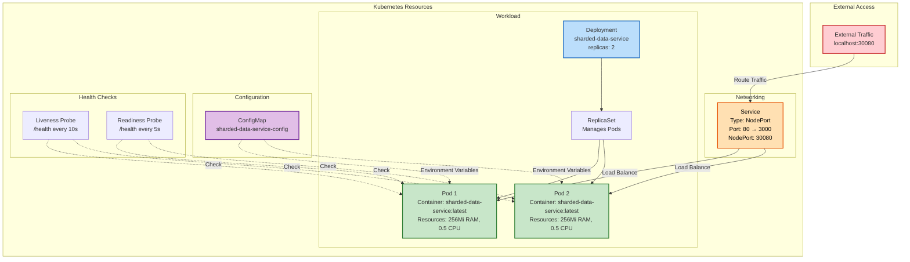
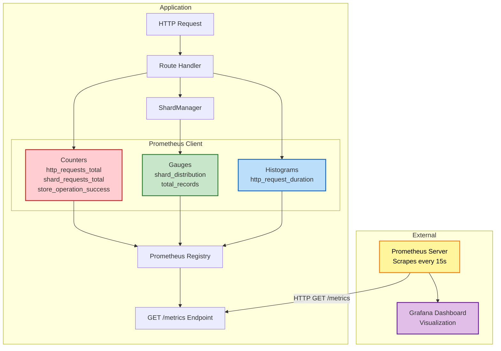
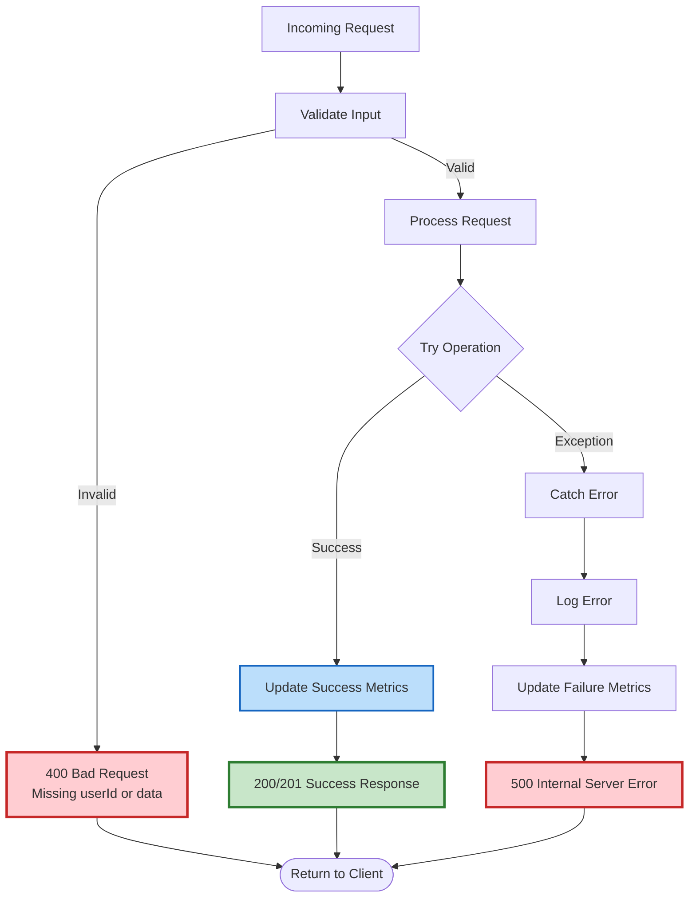
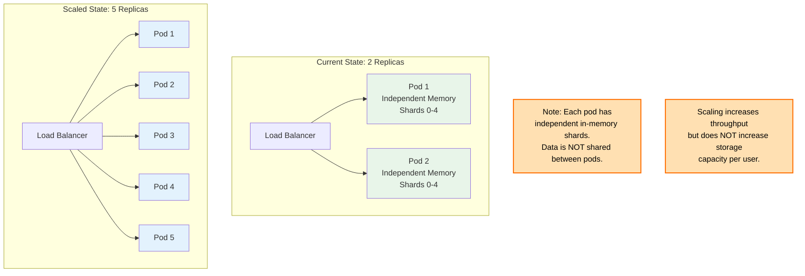

# Sharded Data Service - Architecture Design

This document contains the system architecture diagrams for the Sharded Data Service.

## 📊 How to View These Diagrams

### Option 1: GitHub (Automatic)
- Push this file to GitHub - diagrams render automatically

### Option 2: VS Code
- Install "Markdown Preview Mermaid Support" extension
- Open preview (Ctrl+Shift+V)

### Option 3: Online Editors
- Copy diagram code to: https://mermaid.live/
- Export as PNG/SVG for presentations

---

## 1. High-Level System Architecture

This diagram shows the overall system architecture including Kubernetes deployment.

---

## 2. Application Architecture (Internal Components)

This diagram shows the internal structure of each pod/application instance.

---

## 3. Sharding Algorithm Flow

This diagram explains how the sharding mechanism works.

---

## 4. Data Flow - Store Operation

This shows the complete flow when storing data.

---

## 5. Data Flow - Retrieve Operation

This shows the flow when retrieving data.

---

## 6. Shard Distribution Example

This shows how data is distributed across shards.

---

## 7. Kubernetes Deployment Architecture

This shows the Kubernetes resources and their relationships.

---

## 8. Prometheus Metrics Collection

This shows how metrics are collected and exposed.

---

## 9. Error Handling Flow

This shows how errors are handled in the system.

---

## 10. Scaling Strategy

This shows how the system can be scaled.

---

## Summary

These diagrams illustrate:

1. ✅ **System Architecture** - Overall Kubernetes deployment
2. ✅ **Application Structure** - Internal components and layers
3. ✅ **Sharding Algorithm** - How data distribution works
4. ✅ **Data Flows** - Store and retrieve operations
5. ✅ **Distribution** - How users map to shards
6. ✅ **Kubernetes Resources** - Deployment, services, config
7. ✅ **Metrics Collection** - Prometheus integration
8. ✅ **Error Handling** - How errors are managed
9. ✅ **Scaling** - Horizontal scaling strategy

---

### For GitHub README:
- Diagrams render automatically in GitHub markdown
- Can also be rendered in VS Code with extension

