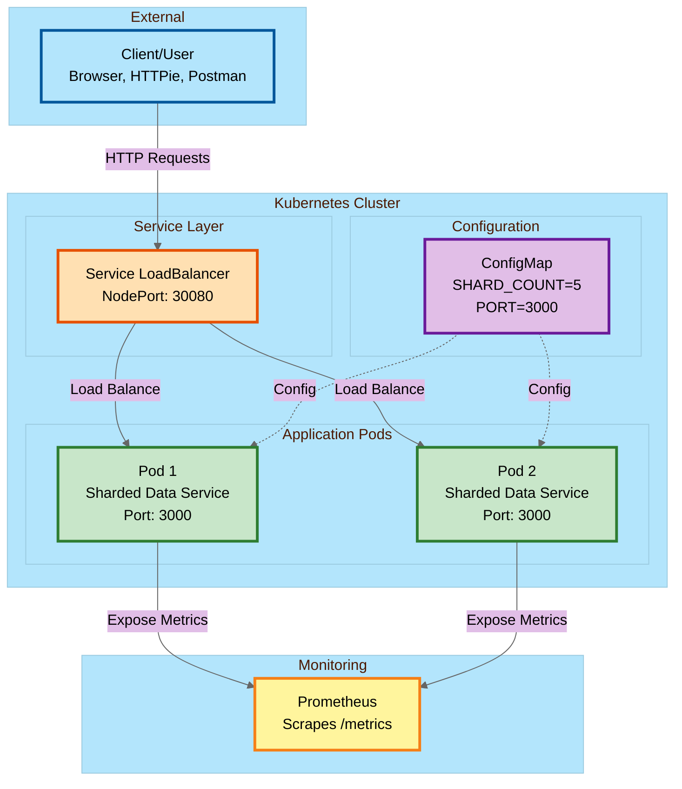
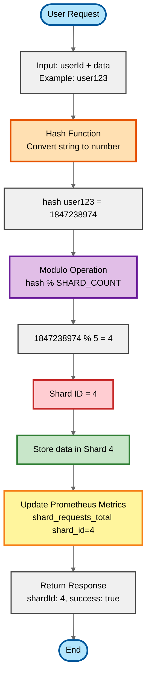
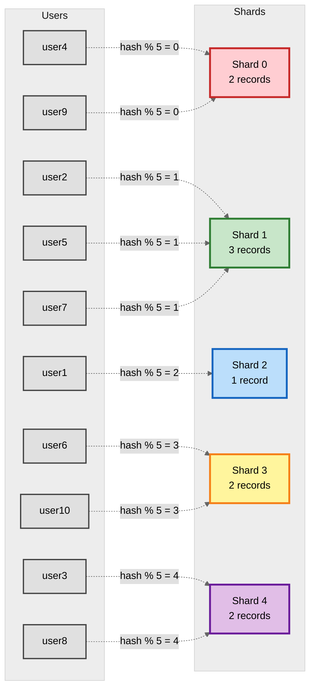

# Sharded Data Service - Architecture Design

This document contains the system architecture diagrams for the Sharded Data Service.

## 1. High-Level System Architecture

This diagram shows the overall system architecture including Kubernetes deployment.

**Key Components:**
- **Client**: External users/applications making HTTP requests
- **Load Balancer**: Kubernetes Service distributing traffic across pods
- **Application Pods**: Two replicas of the sharded data service
- **ConfigMap**: Configuration management (shard count, port, etc.)
- **Prometheus**: Metrics collection and monitoring

---

## 2. Sharding Algorithm Flow

This diagram explains how the sharding mechanism works - the core feature of this system.

**How It Works:**

1. **User Request**: Client sends data with a userId
2. **Hash Function**: Convert userId string to numeric value (e.g., "user123" → 1847238974)
3. **Modulo Operation**: Calculate shard ID using `hash % SHARD_COUNT` (e.g., 1847238974 % 5 = 4)
4. **Store Data**: Data is stored in the calculated shard (Shard 4)
5. **Update Metrics**: Prometheus metrics are updated
6. **Response**: Return success with shard ID

**Key Benefits:**
- ✅ Same userId always maps to the same shard (consistency)
- ✅ Automatic load distribution across shards
- ✅ Fast lookup - O(1) shard determination
- ✅ Scalable - can adjust shard count via configuration

---

## 3. Shard Distribution Example

This diagram shows how data is distributed across shards in practice.

**Distribution Analysis:**

This example shows 10 users distributed across 5 shards:
- **Shard 0**: 2 users (user4, user9)
- **Shard 1**: 3 users (user2, user5, user7) - slightly higher load
- **Shard 2**: 1 user (user1)
- **Shard 3**: 2 users (user6, user10)
- **Shard 4**: 2 users (user3, user8)

**Key Observations:**
- ✅ Reasonably balanced distribution
- ✅ Each user always maps to the same shard
- ✅ As more users are added, distribution becomes more even
- ✅ No single shard becomes a bottleneck

